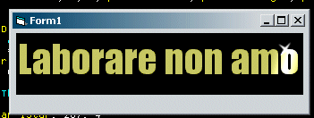



## gdialphablend animated text hi lite \- great for splash screens\!

### Description

Remember the 'Cheers' logo where the hi lite skips left to right across the text and you get a little animated star on the text - well this is like that - flicker free and smooth! Good gfx techniques here using frame buffering, TextOut/SetTextColor to a picture, BitBlt and GDIAlphaBlend.
 
### More Info
 

             |
---                |---
**Submitted On**   |2003-11-28 06:41:04
**By**             |[Fosters](https://github.com/Planet-Source-Code/PSCIndex/blob/master/ByAuthor/fosters.md)
**Level**          |Advanced
**User Rating**    |5.0 (20 globes from 4 users)
**Compatibility**  |VB 5\.0, VB 6\.0
**Category**       |[Graphics](https://github.com/Planet-Source-Code/PSCIndex/blob/master/ByCategory/graphics__1-46.md)
**World**          |[Visual Basic](https://github.com/Planet-Source-Code/PSCIndex/blob/master/ByWorld/visual-basic.md)
**Archive File**   |[gdialphabl16771711282003\.zip](https://github.com/Planet-Source-Code/fosters-gdialphablend-animated-text-hi-lite-great-for-splash-screens__1-50165/archive/master.zip)

